# OpenCROW Runtime Dashboard Architecture

This document describes the dashboard-managed OpenCROW execution architecture introduced by the runtime rework. It covers the high-level design, operational flows, API surface, storage model, and code-level implementation so the system can be extended without rediscovering the control-plane/runtime contract from the source.

The design goal is to move Codex execution out of terminal-only commands and into a dashboard-controlled platform. Constellation owns orchestration state, approvals, event history, and user/API access. A separate host runtime owns Codex SDK execution because that process needs host tools, user credentials, challenge workspaces, and non-containerized access to local CTF tooling.

## Design Drivers

The architecture is shaped by these constraints:

- The Codex SDK must run in a host runtime process, not inside the Constellation containers.
- The dashboard must manage multiple challenges and multiple agents in real time.
- A single-agent challenge must be cheap to create: one agent plans and executes end to end.
- A challenge must be promotable into Constellation mode where a master agent can coordinate additional agents.
- Remote machines should be able to register as runtimes by dialing out to the control plane.
- Legacy terminal commands should become compatibility clients, not independent Codex launchers.
- Agents need an API surface that lets them inspect, request, prompt, approve, reject, and interrupt platform agents.
- Control-plane state must survive runtime disconnects and support queued command replay.

## Vocabulary

| Term | Meaning |
| --- | --- |
| Control plane | The Tornado backend plus MongoDB/GridFS state used by Constellation. |
| Dashboard | The Flask UI that renders runtime, challenge, file, agent, and event views. |
| Runtime | A non-containerized host process launched by `opencrow-constellation-runtime`. |
| Challenge | A dashboard-managed solve unit with metadata, files, agents, events, and a selected runtime. |
| Agent | A persisted Codex execution record bound to a challenge and runtime. |
| Runtime command | A durable command queued by the backend and consumed by a runtime over websocket. |
| Agent event | An append-only event emitted by the runtime or storage layer for audit and UI display. |
| Single-agent mode | Challenge mode where one `solo` agent plans and executes. |
| Constellation mode | Challenge mode where the first agent is a `master` and additional `slave` agents may be spawned. |

## C4 Context

The system context separates the human/agent clients from the control plane and the host runtime. The runtime connects outbound to the backend, so it can run on the same workstation, a jump host, or a remote machine with access to challenge tooling.

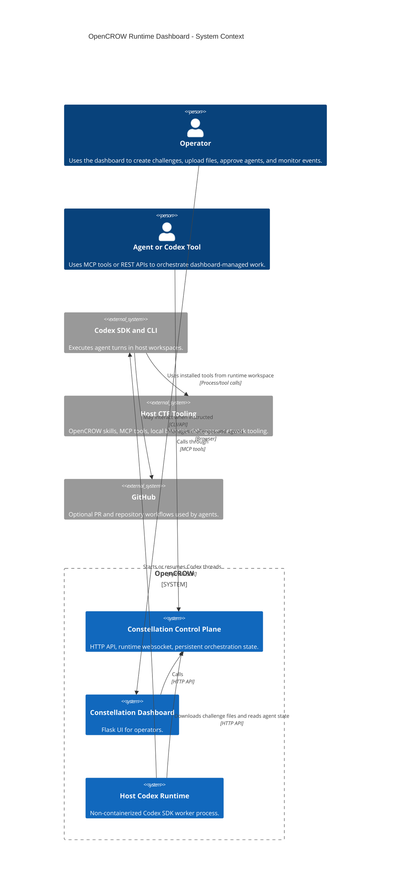
```mermaid
C4Context
    title OpenCROW Runtime Dashboard - System Context

    Person(operator, "Operator", "Uses the dashboard to create challenges, upload files, approve agents, and monitor events.")
    Person(agentUser, "Agent or Codex Tool", "Uses MCP tools or REST APIs to orchestrate dashboard-managed work.")

    System_Boundary(opencrow, "OpenCROW") {
        System(controlPlane, "Constellation Control Plane", "HTTP API, runtime websocket, persistent orchestration state.")
        System(dashboard, "Constellation Dashboard", "Flask UI for operators.")
        System(runtime, "Host Codex Runtime", "Non-containerized Codex SDK worker process.")
    }

    System_Ext(codex, "Codex SDK and CLI", "Executes agent turns in host workspaces.")
    System_Ext(hostTools, "Host CTF Tooling", "OpenCROW skills, MCP tools, local binaries, debuggers, network tooling.")
    System_Ext(github, "GitHub", "Optional PR and repository workflows used by agents.")

    Rel(operator, dashboard, "Manages challenges and agents", "Browser")
    Rel(dashboard, controlPlane, "Calls", "HTTP API")
    Rel(agentUser, controlPlane, "Calls directly", "REST")
    Rel(agentUser, controlPlane, "Calls through", "MCP tools")
    Rel(runtime, controlPlane, "Registers, receives commands, emits state/events", "WebSocket opencrow.runtime.v1")
    Rel(runtime, controlPlane, "Downloads challenge files and reads agent state", "HTTP API")
    Rel(runtime, codex, "Starts or resumes Codex threads", "Python SDK")
    Rel(codex, hostTools, "Uses installed tools from runtime workspace", "Process/tool calls")
    Rel(codex, github, "May interact when instructed", "CLI/API")
```

## C4 Containers

The backend and UI can stay containerized. The runtime is explicitly outside the container boundary and connects to the backend with the same bearer token model as other clients.

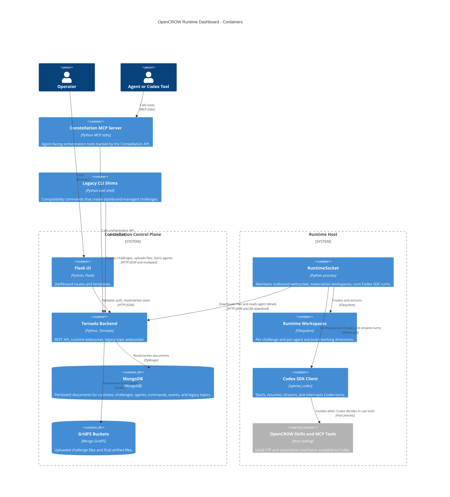
```mermaid
C4Container
    title OpenCROW Runtime Dashboard - Containers

    Person(operator, "Operator")
    Person(agentUser, "Agent or Codex Tool")

    System_Boundary(control, "Constellation Control Plane") {
        Container(ui, "Flask UI", "Python, Flask", "Dashboard routes and templates.")
        Container(api, "Tornado Backend", "Python, Tornado", "REST API, runtime websocket, legacy topic websocket.")
        ContainerDb(mongo, "MongoDB", "MongoDB", "Persistent documents for runtimes, challenges, agents, commands, events, and legacy topics.")
        ContainerDb(gridfs, "GridFS Buckets", "Mongo GridFS", "Uploaded challenge files and final artifact files.")
    }

    System_Boundary(host, "Runtime Host") {
        Container(runtime, "RuntimeSocket", "Python process", "Maintains outbound websocket, materializes workspaces, runs Codex SDK turns.")
        Container(workspaces, "Runtime Workspaces", "Filesystem", "Per-challenge and per-agent extracted working directories.")
        Container(sdk, "Codex SDK Client", "openai_codex", "Starts, resumes, streams, and interrupts Codex turns.")
        Container_Ext(tools, "OpenCROW Skills and MCP Tools", "Host tooling", "Local CTF and automation toolchains available to Codex.")
    }

    Container(mcp, "Constellation MCP Server", "Python MCP stdio", "Agent-facing orchestration tools backed by the Constellation API.")
    Container(cli, "Legacy CLI Shims", "Python and shell", "Compatibility commands that create dashboard-managed challenges.")

    Rel(operator, ui, "Uses", "Browser")
    Rel(ui, api, "Validates auth, reads/writes state", "HTTP JSON")
    Rel(agentUser, mcp, "Calls tools", "MCP stdio")
    Rel(mcp, api, "Calls orchestration API", "HTTP JSON")
    Rel(cli, api, "Creates challenges, uploads files, starts agents", "HTTP JSON and multipart")
    Rel(api, mongo, "Reads/writes documents", "PyMongo")
    Rel(api, gridfs, "Stores/downloads blobs", "GridFS")
    Rel(runtime, api, "Registers and consumes queued commands", "WebSocket")
    Rel(runtime, api, "Downloads files and reads agent details", "HTTP JSON and file download")
    Rel(runtime, workspaces, "Creates and extracts", "Filesystem")
    Rel(runtime, sdk, "Starts/resumes threads and streams turns", "Python API")
    Rel(sdk, tools, "Invokes when Codex decides to use tools", "Host process")
```

## C4 Components

The backend runtime surface is small: handlers validate tokens and payloads, `AppState` delivers commands to connected sockets, and `ConstellationStorage` persists all durable state.

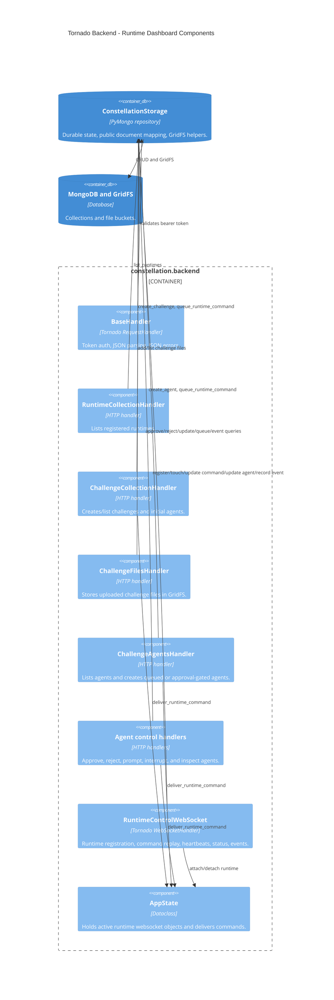
```mermaid
C4Component
    title Tornado Backend - Runtime Dashboard Components

    Container_Boundary(api, "constellation.backend") {
        Component(baseHandler, "BaseHandler", "Tornado RequestHandler", "Token auth, JSON parsing, JSON errors.")
        Component(runtimeCollection, "RuntimeCollectionHandler", "HTTP handler", "Lists registered runtimes.")
        Component(challengeCollection, "ChallengeCollectionHandler", "HTTP handler", "Creates/list challenges and initial agents.")
        Component(challengeFiles, "ChallengeFilesHandler", "HTTP handler", "Stores uploaded challenge files in GridFS.")
        Component(challengeAgents, "ChallengeAgentsHandler", "HTTP handler", "Lists agents and creates queued or approval-gated agents.")
        Component(agentControl, "Agent control handlers", "HTTP handlers", "Approve, reject, prompt, interrupt, and inspect agents.")
        Component(runtimeWs, "RuntimeControlWebSocket", "Tornado WebSocketHandler", "Runtime registration, command replay, heartbeats, status, events.")
        Component(appState, "AppState", "Dataclass", "Holds active runtime websocket objects and delivers commands.")
    }

    ContainerDb(storage, "ConstellationStorage", "PyMongo repository", "Durable state, public document mapping, GridFS helpers.")
    ContainerDb(mongo, "MongoDB and GridFS", "Database", "Collections and file buckets.")

    Rel(baseHandler, storage, "Validates bearer token")
    Rel(runtimeCollection, storage, "list_runtimes")
    Rel(challengeCollection, storage, "create_challenge, queue_runtime_command")
    Rel(challengeCollection, appState, "deliver_runtime_command")
    Rel(challengeFiles, storage, "add/list challenge files")
    Rel(challengeAgents, storage, "create_agent, queue_runtime_command")
    Rel(challengeAgents, appState, "deliver_runtime_command")
    Rel(agentControl, storage, "approve/reject/update/queue/event queries")
    Rel(agentControl, appState, "deliver_runtime_command")
    Rel(runtimeWs, storage, "register/touch/update command/update agent/record event")
    Rel(runtimeWs, appState, "attach/detach runtime")
    Rel(storage, mongo, "CRUD and GridFS")
```

The runtime component is deliberately thin. It does not own platform state; it consumes commands, performs host execution, and reports results back to the backend.

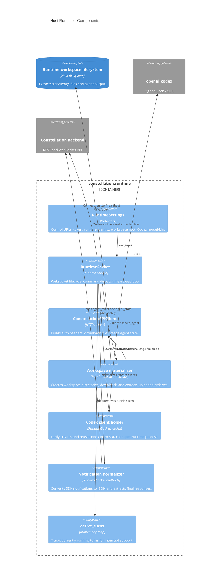
```mermaid
C4Component
    title Host Runtime - Components

    Container_Boundary(runtimeProcess, "constellation.runtime") {
        Component(settings, "RuntimeSettings", "Dataclass", "Control URLs, token, runtime identity, workspace root, Codex model/bin.")
        Component(socket, "RuntimeSocket", "Runtime service", "Websocket lifecycle, command dispatch, heartbeat loop.")
        Component(apiClient, "ConstellationAPIClient", "HTTP helper", "Builds auth headers, downloads files, reads agent state.")
        Component(workspace, "Workspace materializer", "RuntimeSocket methods", "Creates workspace directories, downloads and extracts uploaded archives.")
        Component(codexClient, "Codex client holder", "RuntimeSocket._codex", "Lazily creates and reuses one Codex SDK client per runtime process.")
        Component(streamNormalizer, "Notification normalizer", "RuntimeSocket methods", "Converts SDK notifications to JSON and extracts final responses.")
        Component(activeTurns, "active_turns", "In-memory map", "Tracks currently running turns for interrupt support.")
    }

    ContainerDb(filesystem, "Runtime workspace filesystem", "Host filesystem", "Extracted challenge files and agent output.")
    System_Ext(openaiCodex, "openai_codex", "Python Codex SDK", "Thread and turn API.")
    System_Ext(controlPlane, "Constellation Backend", "REST and WebSocket API", "Command and event control plane.")

    Rel(settings, socket, "Configures")
    Rel(socket, controlPlane, "Connect/register/heartbeat", "WebSocket")
    Rel(socket, workspace, "Calls for spawn_agent")
    Rel(workspace, apiClient, "Downloads challenge file blobs")
    Rel(workspace, filesystem, "Writes archives and extracted files")
    Rel(socket, codexClient, "Starts/resumes turns")
    Rel(codexClient, openaiCodex, "Uses")
    Rel(socket, activeTurns, "Adds/removes running turn")
    Rel(socket, streamNormalizer, "Normalizes stream events")
    Rel(streamNormalizer, controlPlane, "Sends agent_event and agent_state", "WebSocket")
```

## Runtime Boundary

The runtime boundary is intentionally explicit:

- Constellation stores state, validates tokens, queues commands, and records events.
- The runtime owns host execution and local filesystem workspaces.
- The runtime does not require inbound network access; it dials `/runtime/ws`.
- If the websocket is disconnected, commands remain in MongoDB as `queued`.
- When the runtime reconnects and registers, the backend replays queued commands for that runtime.
- Runtime files are copied from GridFS into the workspace only when a `spawn_agent` command is handled.
- Codex SDK import is lazy. A runtime without `openai_codex` can still register and advertise `codex_sdk: false`, but agent execution fails with an explicit SDK-missing error.

## Deployment Topology

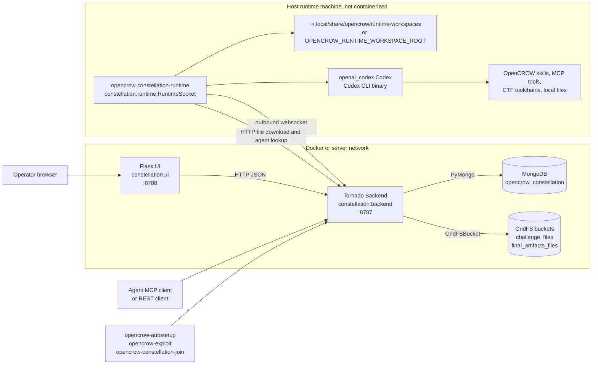
```mermaid
flowchart LR
    subgraph ContainerNetwork["Docker or server network"]
        UI["Flask UI\nconstellation.ui\n:8788"]
        API["Tornado Backend\nconstellation.backend\n:8787"]
        Mongo[("MongoDB\nopencrow_constellation")]
        GridFS[("GridFS buckets\nchallenge_files\nfinal_artifacts_files")]
        UI -->|HTTP JSON| API
        API -->|PyMongo| Mongo
        API -->|GridFSBucket| GridFS
    end

    subgraph RuntimeHost["Host runtime machine, not containerized"]
        Runtime["opencrow-constellation-runtime\nconstellation.runtime.RuntimeSocket"]
        Workspaces["~/.local/share/opencrow/runtime-workspaces\nor OPENCROW_RUNTIME_WORKSPACE_ROOT"]
        Codex["openai_codex.Codex\nCodex CLI binary"]
        Tools["OpenCROW skills, MCP tools,\nCTF toolchains, local files"]
        Runtime --> Workspaces
        Runtime --> Codex
        Codex --> Tools
    end

    Browser["Operator browser"] --> UI
    AgentClient["Agent MCP client\nor REST client"] --> API
    LegacyCLI["opencrow-autosetup\nopencrow-exploit\nopencrow-constellation-join"] --> API
    Runtime -->|outbound websocket /runtime/ws| API
    Runtime -->|HTTP file download and agent lookup| API
```

## Storage Model

The rework adds runtime-dashboard collections alongside the existing legacy Constellation topic collections. The new collections are deliberately generic and event-oriented.

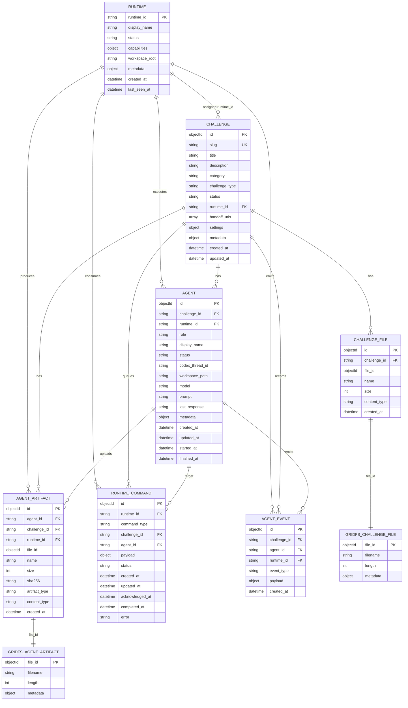
```mermaid
erDiagram
    RUNTIME {
        string runtime_id PK
        string display_name
        string status
        object capabilities
        string workspace_root
        object metadata
        datetime created_at
        datetime last_seen_at
    }

    CHALLENGE {
        objectId id PK
        string slug UK
        string title
        string description
        string category
        string challenge_type
        string status
        string runtime_id FK
        array handoff_urls
        object settings
        object metadata
        datetime created_at
        datetime updated_at
    }

    CHALLENGE_FILE {
        objectId id PK
        string challenge_id FK
        objectId file_id
        string name
        int size
        string content_type
        datetime created_at
    }

    AGENT {
        objectId id PK
        string challenge_id FK
        string runtime_id FK
        string role
        string display_name
        string status
        string codex_thread_id
        string workspace_path
        string model
        string prompt
        string last_response
        object metadata
        datetime created_at
        datetime updated_at
        datetime started_at
        datetime finished_at
    }

    AGENT_ARTIFACT {
        objectId id PK
        string agent_id FK
        string challenge_id FK
        string runtime_id FK
        objectId file_id
        string name
        int size
        string sha256
        string artifact_type
        string content_type
        datetime created_at
    }

    RUNTIME_COMMAND {
        objectId id PK
        string runtime_id FK
        string command_type
        string challenge_id FK
        string agent_id FK
        object payload
        string status
        datetime created_at
        datetime updated_at
        datetime acknowledged_at
        datetime completed_at
        string error
    }

    AGENT_EVENT {
        objectId id PK
        string challenge_id FK
        string agent_id FK
        string runtime_id FK
        string event_type
        object payload
        datetime created_at
    }

    GRIDFS_CHALLENGE_FILE {
        objectId file_id PK
        string filename
        int length
        object metadata
    }

    GRIDFS_AGENT_ARTIFACT {
        objectId file_id PK
        string filename
        int length
        object metadata
    }

    RUNTIME ||--o{ CHALLENGE : "assigned runtime_id"
    RUNTIME ||--o{ AGENT : "executes"
    RUNTIME ||--o{ AGENT_ARTIFACT : "produces"
    RUNTIME ||--o{ RUNTIME_COMMAND : "consumes"
    RUNTIME ||--o{ AGENT_EVENT : "emits"
    CHALLENGE ||--o{ CHALLENGE_FILE : "has"
    CHALLENGE ||--o{ AGENT : "has"
    CHALLENGE ||--o{ AGENT_ARTIFACT : "has"
    CHALLENGE ||--o{ RUNTIME_COMMAND : "queues"
    CHALLENGE ||--o{ AGENT_EVENT : "records"
    AGENT ||--o{ AGENT_ARTIFACT : "uploads"
    AGENT ||--o{ RUNTIME_COMMAND : "target"
    AGENT ||--o{ AGENT_EVENT : "emits"
    CHALLENGE_FILE ||--|| GRIDFS_CHALLENGE_FILE : "file_id"
    AGENT_ARTIFACT ||--|| GRIDFS_AGENT_ARTIFACT : "file_id"
```

### Collections And Indexes

`ConstellationStorage.ensure_indexes()` creates the runtime-dashboard indexes below:

| Collection | Index | Purpose |
| --- | --- | --- |
| `runtimes` | `runtime_id` unique | Stable runtime identity and upsert target. |
| `runtimes` | `last_seen_at desc` | Runtime fleet ordering. |
| `challenges` | `slug` unique | Human-readable challenge lookup. |
| `challenges` | `created_at desc` | Dashboard list ordering. |
| `challenges` | `runtime_id, status` | Runtime/status filtering. |
| `challenge_files` | `challenge_id, created_at desc` | File listing per challenge. |
| `agents` | `challenge_id, created_at` | Ordered challenge agent list. |
| `agents` | `runtime_id, status` | Runtime work/status filtering. |
| `agent_artifacts` | `agent_id, created_at desc` | Artifact listing per agent. |
| `agent_artifacts` | `challenge_id, created_at desc` | Artifact lookup per challenge. |
| `runtime_commands` | `runtime_id, status, created_at` | Replay queued commands in FIFO order. |
| `runtime_commands` | `agent_id, created_at` | Agent command history. |
| `agent_events` | `challenge_id, created_at desc` | Challenge event feed. |
| `agent_events` | `agent_id, created_at desc` | Agent event feed. |
| `agent_events` | `runtime_id, created_at desc` | Runtime event feed. |

## State Machines

### Runtime State

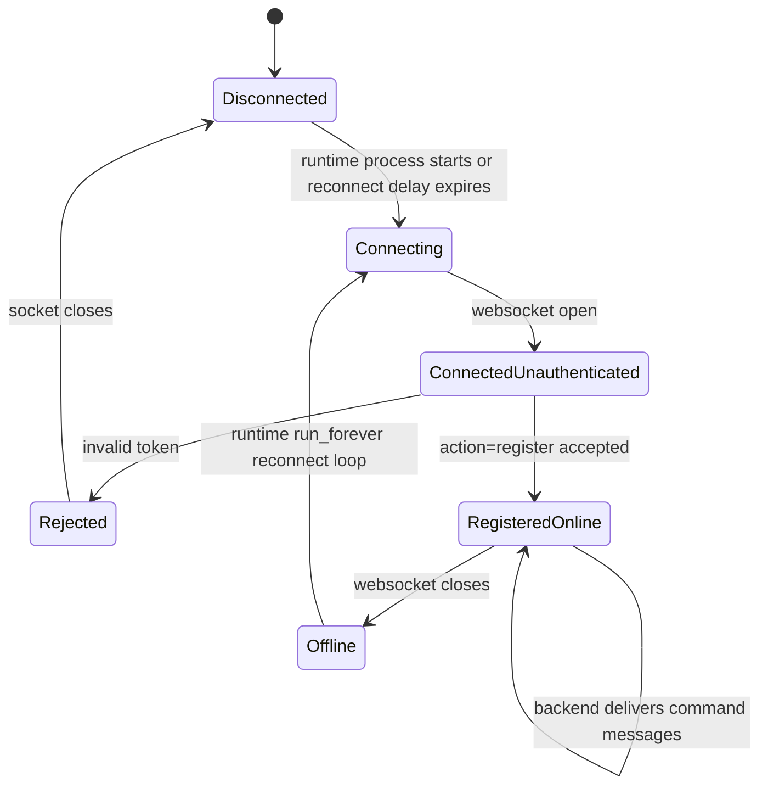
```mermaid
stateDiagram-v2
    [*] --> Disconnected
    Disconnected --> Connecting: runtime process starts or reconnect delay expires
    Connecting --> ConnectedUnauthenticated: websocket open
    ConnectedUnauthenticated --> Rejected: invalid token
    ConnectedUnauthenticated --> RegisteredOnline: action=register accepted
    RegisteredOnline --> RegisteredOnline: action=heartbeat updates last_seen_at
    RegisteredOnline --> RegisteredOnline: backend delivers command messages
    RegisteredOnline --> Offline: websocket closes
    Offline --> Connecting: runtime run_forever reconnect loop
    Rejected --> Disconnected: socket closes
```

### Runtime Command State

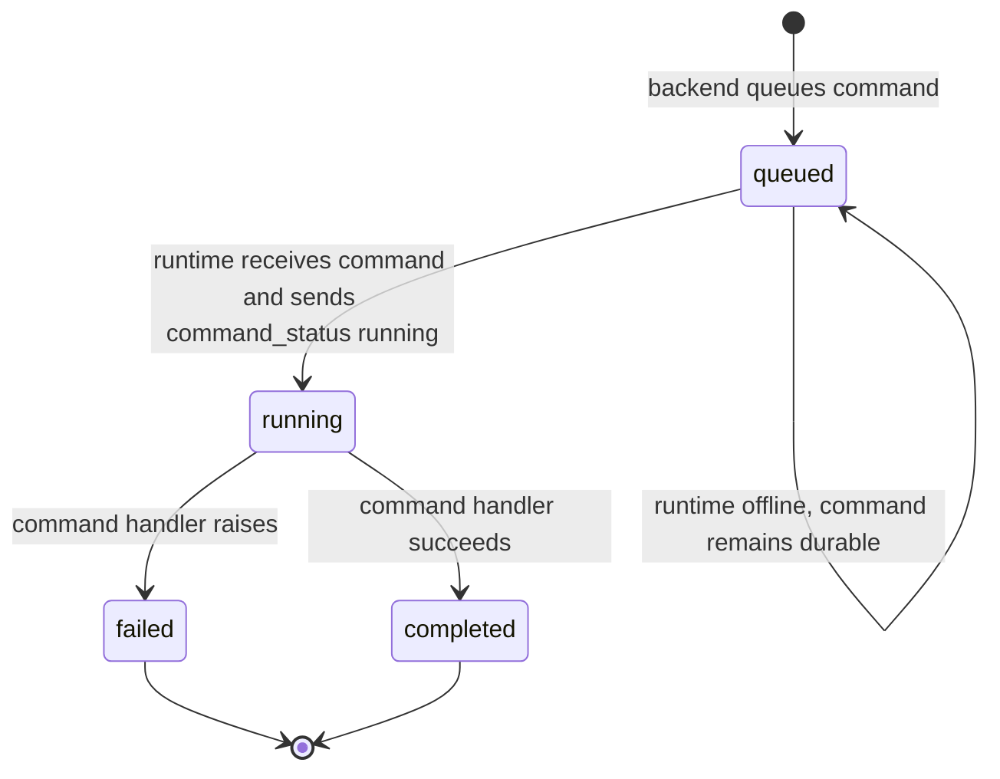
```mermaid
stateDiagram-v2
    [*] --> queued: backend queues command
    queued --> running: runtime receives command and sends command_status running
    running --> completed: command handler succeeds
    running --> failed: command handler raises
    queued --> queued: runtime offline, command remains durable
    failed --> [*]
    completed --> [*]
```

### Agent State

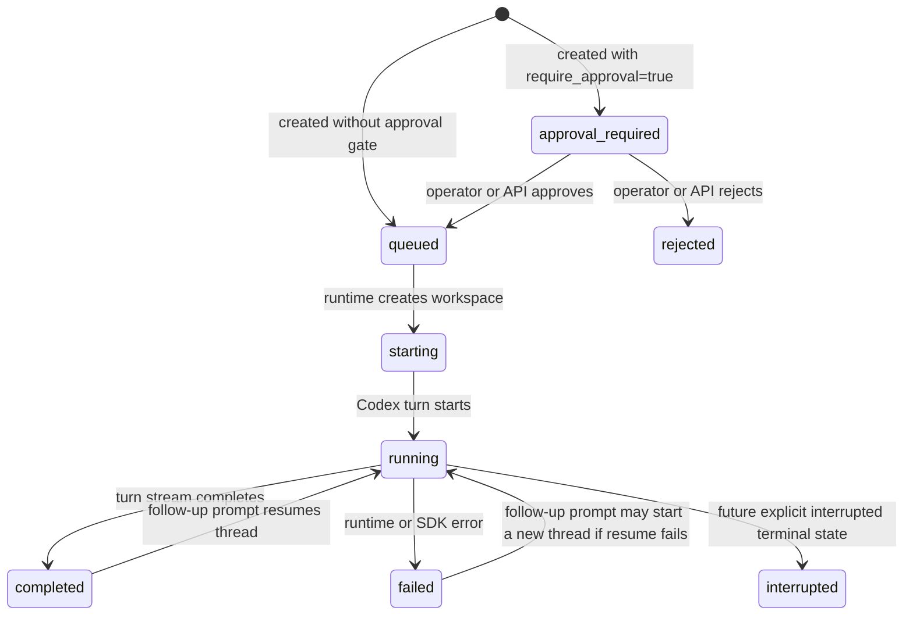
```mermaid
stateDiagram-v2
    [*] --> queued: created without approval gate
    [*] --> approval_required: created with require_approval=true
    approval_required --> queued: operator or API approves
    approval_required --> rejected: operator or API rejects
    queued --> starting: runtime creates workspace
    starting --> running: Codex turn starts
    running --> completed: turn stream completes
    running --> failed: runtime or SDK error
    running --> interrupted: future explicit interrupted terminal state
    completed --> running: follow-up prompt resumes thread
    failed --> running: follow-up prompt may start a new thread if resume fails
```

## Runtime WebSocket Protocol

The runtime websocket is mounted at `/runtime/ws` and selects the `opencrow.runtime.v1` subprotocol. Authentication uses the same system bearer token as the REST API. The token may be supplied by `Authorization: Bearer ...`, by `?token=...`, or by websocket subprotocol token encoding from `ConstellationAPIClient`.

### Runtime To Backend Messages

| Action | Purpose | Important fields |
| --- | --- | --- |
| `register` | Register or update runtime document, attach live socket, replay queued commands. | `runtime_id`, `display_name`, `workspace_root`, `capabilities`, `metadata` |
| `heartbeat` | Refresh `last_seen_at` and keep runtime online. | none |
| `command_status` | Update durable runtime command state. | `command_id`, `status`, `error` |
| `agent_state` | Update persisted agent fields and append an `agent_state` event. | `agent_id`, `status`, `codex_thread_id`, `workspace_path`, `last_response`, `metadata` |
| `agent_event` | Append an event to the challenge/agent feed. | `challenge_id`, `agent_id`, `event_type`, `payload` |

### Backend To Runtime Messages

| Event type | Purpose |
| --- | --- |
| `hello` | Confirms websocket accepted the connection and protocol. |
| `registered` | Confirms the runtime document and assigned runtime id. |
| `heartbeat` | Acknowledges heartbeat and returns runtime state. |
| `command` | Delivers a queued command to the runtime. |
| `command_status` | Acknowledges a command state update. |
| `agent_state` | Acknowledges an agent state update. |
| `agent_event` | Acknowledges an event append. |
| `error` | Reports malformed payloads or unsupported actions. |

### Runtime Commands

| Command type | Runtime behavior |
| --- | --- |
| `spawn_agent` | Create workspace, download/extract challenge files, mark agent `starting`, then run initial Codex turn. |
| `prompt_agent` | Read persisted agent state, locate `workspace_path`, resume/start Codex thread, and run a follow-up turn. |
| `interrupt_agent` | Look up the in-memory active turn and call `turn.interrupt()`, or emit `interrupt_noop` if nothing is running. |

## REST API Surface

All endpoints below live under `/api/v1` and require a valid system bearer token unless noted.

### Runtime Endpoints

| Method | Path | Handler | Behavior |
| --- | --- | --- | --- |
| `GET` | `/runtimes` | `RuntimeCollectionHandler` | List registered runtime documents ordered by recent heartbeat. |
| `GET` | `/runtimes/{runtime_id}/commands` | `RuntimeCommandsHandler` | Inspect durable runtime commands, optionally filtered by `status`. |

### Challenge Endpoints

| Method | Path | Handler | Behavior |
| --- | --- | --- | --- |
| `GET` | `/challenges` | `ChallengeCollectionHandler` | List dashboard-managed challenges. |
| `POST` | `/challenges` | `ChallengeCollectionHandler` | Create a challenge, optionally create the first agent, and queue a `spawn_agent` command. |
| `GET` | `/challenges/{id_or_slug}` | `ChallengeItemHandler` | Read a challenge by ObjectId or slug. |
| `POST` | `/challenges/{id}/convert-to-constellation` | `ChallengeConvertHandler` | Change `challenge_type` to `constellation` and promote the first agent to `master`. |
| `GET` | `/challenges/{id}/files` | `ChallengeFilesHandler` | List uploaded challenge files. |
| `POST` | `/challenges/{id}/files` | `ChallengeFilesHandler` | Upload one or more files to GridFS and create file metadata documents. |
| `GET` | `/challenges/{id}/agents` | `ChallengeAgentsHandler` | List agents for a challenge. |
| `POST` | `/challenges/{id}/agents` | `ChallengeAgentsHandler` | Create a `solo`, `master`, or `slave` agent; queue immediately or hold for approval. |
| `GET` | `/challenges/{id}/events` | `ChallengeEventsHandler` | Read challenge event history. |

### Agent Endpoints

| Method | Path | Handler | Behavior |
| --- | --- | --- | --- |
| `GET` | `/agents/{id}` | `AgentItemHandler` | Read one agent document. |
| `POST` | `/agents/{id}/approve` | `AgentApproveHandler` | Move an approval-gated agent to `queued` and queue `spawn_agent`. |
| `POST` | `/agents/{id}/reject` | `AgentRejectHandler` | Move an approval-gated agent to `rejected` and record the reason. |
| `GET` | `/agents/{id}/events` | `AgentEventsHandler` | Read agent event history. |
| `GET` | `/agents/{id}/artifacts` | `AgentArtifactsHandler` | List runtime-collected artifacts such as writeups for an agent. |
| `POST` | `/agents/{id}/artifacts` | `AgentArtifactsHandler` | Upload agent artifacts into GridFS and record `agent_artifact` events. |
| `POST` | `/agents/{id}/prompt` | `AgentPromptHandler` | Queue a follow-up prompt through `prompt_agent`. |
| `POST` | `/agents/{id}/interrupt` | `AgentInterruptHandler` | Queue an `interrupt_agent` command. |
| `GET` | `/challenge-files/{file_id}` | `ChallengeFileDownloadHandler` | Download one GridFS challenge file. |
| `GET` | `/agent-artifacts/{file_id}` | `AgentArtifactDownloadHandler` | Download one GridFS agent artifact. |

The older topic/session endpoints remain in the backend for compatibility with previous Constellation collaboration flows. The runtime-dashboard challenge/agent model is separate and does not require topic membership.

## Sequence Diagrams

### Runtime Registration And Queued Command Replay

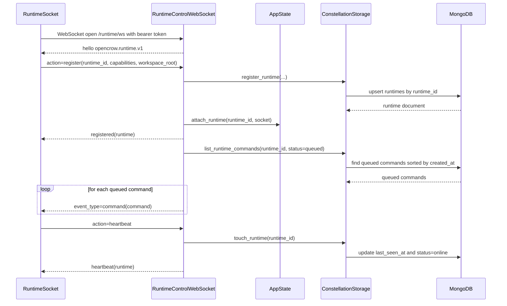
```mermaid
sequenceDiagram
    participant Runtime as RuntimeSocket
    participant Backend as RuntimeControlWebSocket
    participant State as AppState
    participant Store as ConstellationStorage
    participant Mongo as MongoDB

    Runtime->>Backend: WebSocket open /runtime/ws with bearer token
    Backend-->>Runtime: hello opencrow.runtime.v1
    Runtime->>Backend: action=register(runtime_id, capabilities, workspace_root)
    Backend->>Store: register_runtime(...)
    Store->>Mongo: upsert runtimes by runtime_id
    Mongo-->>Store: runtime document
    Backend->>State: attach_runtime(runtime_id, socket)
    Backend-->>Runtime: registered(runtime)
    Backend->>Store: list_runtime_commands(runtime_id, status=queued)
    Store->>Mongo: find queued commands sorted by created_at
    Mongo-->>Store: queued commands
    loop for each queued command
        Backend-->>Runtime: event_type=command(command)
    end
    Runtime->>Backend: action=heartbeat
    Backend->>Store: touch_runtime(runtime_id)
    Store->>Mongo: update last_seen_at and status=online
    Backend-->>Runtime: heartbeat(runtime)
```

### Dashboard Challenge Creation With Initial Agent

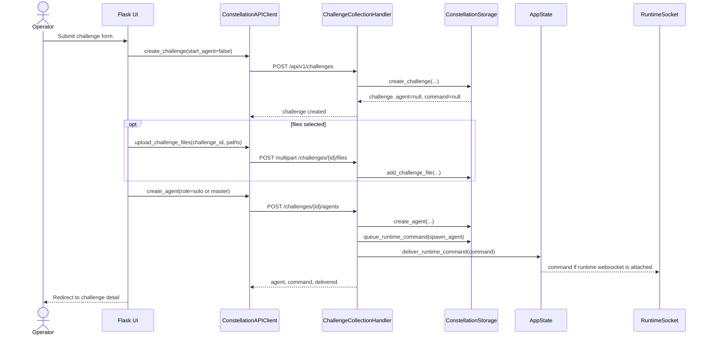
```mermaid
sequenceDiagram
    actor Operator
    participant UI as Flask UI
    participant Client as ConstellationAPIClient
    participant Backend as ChallengeCollectionHandler
    participant Store as ConstellationStorage
    participant State as AppState
    participant Runtime as RuntimeSocket

    Operator->>UI: Submit challenge form
    UI->>Client: create_challenge(start_agent=false)
    Client->>Backend: POST /api/v1/challenges
    Backend->>Store: create_challenge(...)
    Store-->>Backend: challenge, agent=null, command=null
    Backend-->>Client: challenge created
    opt files selected
        UI->>Client: upload_challenge_files(challenge_id, paths)
        Client->>Backend: POST multipart /challenges/{id}/files
        Backend->>Store: add_challenge_file(...)
    end
    UI->>Client: create_agent(role=solo or master)
    Client->>Backend: POST /challenges/{id}/agents
    Backend->>Store: create_agent(...)
    Backend->>Store: queue_runtime_command(spawn_agent)
    Backend->>State: deliver_runtime_command(command)
    State-->>Runtime: command if runtime websocket is attached
    Backend-->>Client: agent, command, delivered
    UI-->>Operator: Redirect to challenge detail
```

### Legacy CLI Compatibility Flow

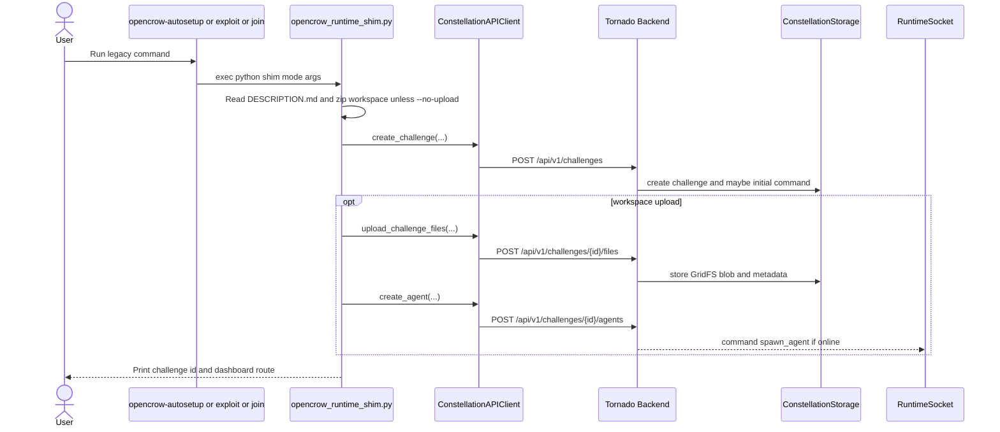
```mermaid
sequenceDiagram
    actor User
    participant CLI as opencrow-autosetup or exploit or join
    participant Shim as opencrow_runtime_shim.py
    participant Client as ConstellationAPIClient
    participant Backend as Tornado Backend
    participant Store as ConstellationStorage
    participant Runtime as RuntimeSocket

    User->>CLI: Run legacy command
    CLI->>Shim: exec python shim mode args
    Shim->>Shim: Read DESCRIPTION.md and zip workspace unless --no-upload
    Shim->>Client: create_challenge(...)
    Client->>Backend: POST /api/v1/challenges
    Backend->>Store: create challenge and maybe initial command
    opt workspace upload
        Shim->>Client: upload_challenge_files(...)
        Client->>Backend: POST /api/v1/challenges/{id}/files
        Backend->>Store: store GridFS blob and metadata
        Shim->>Client: create_agent(...)
        Client->>Backend: POST /api/v1/challenges/{id}/agents
        Backend-->>Runtime: command spawn_agent if online
    end
    Shim-->>User: Print challenge id and dashboard route
```

### Runtime Agent Spawn And Codex Stream

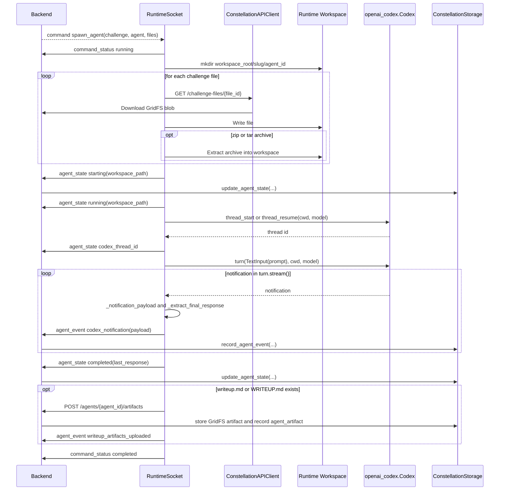
```mermaid
sequenceDiagram
    participant Backend as Backend
    participant Runtime as RuntimeSocket
    participant Client as ConstellationAPIClient
    participant FS as Runtime Workspace
    participant SDK as openai_codex.Codex
    participant Store as ConstellationStorage

    Backend-->>Runtime: command spawn_agent(challenge, agent, files)
    Runtime->>Backend: command_status running
    Runtime->>FS: mkdir workspace_root/slug/agent_id
    loop for each challenge file
        Runtime->>Client: GET /challenge-files/{file_id}
        Client->>Backend: Download GridFS blob
        Runtime->>FS: Write file
        opt zip or tar archive
            Runtime->>FS: Extract archive into workspace
        end
    end
    Runtime->>Backend: agent_state starting(workspace_path)
    Backend->>Store: update_agent_state(...)
    Runtime->>Backend: agent_state running(workspace_path)
    Runtime->>SDK: thread_start or thread_resume(cwd, model)
    SDK-->>Runtime: thread id
    Runtime->>Backend: agent_state codex_thread_id
    Runtime->>SDK: turn(TextInput(prompt), cwd, model)
    loop notification in turn.stream()
        SDK-->>Runtime: notification
        Runtime->>Runtime: _notification_payload and _extract_final_response
        Runtime->>Backend: agent_event codex_notification(payload)
        Backend->>Store: record_agent_event(...)
    end
    Runtime->>Backend: agent_state completed(last_response)
    Backend->>Store: update_agent_state(...)
    opt writeup.md or WRITEUP.md exists
        Runtime->>Backend: POST /agents/{agent_id}/artifacts
        Backend->>Store: store GridFS artifact and record agent_artifact
        Runtime->>Backend: agent_event writeup_artifacts_uploaded
    end
    Runtime->>Backend: command_status completed
```

### Follow-Up Prompt

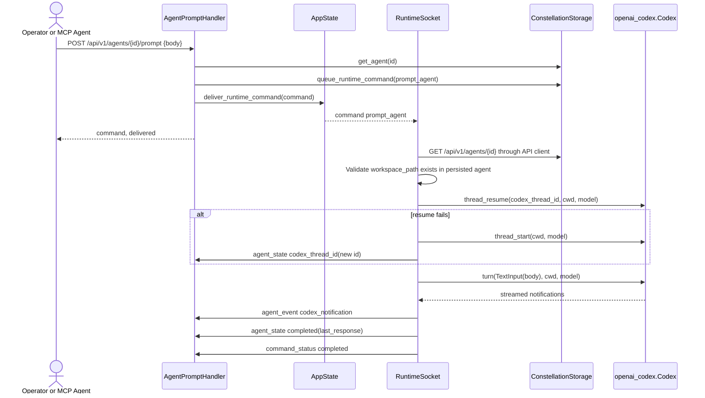
```mermaid
sequenceDiagram
    actor OperatorOrAgent as Operator or MCP Agent
    participant API as AgentPromptHandler
    participant State as AppState
    participant Runtime as RuntimeSocket
    participant Store as ConstellationStorage
    participant SDK as openai_codex.Codex

    OperatorOrAgent->>API: POST /api/v1/agents/{id}/prompt {body}
    API->>Store: get_agent(id)
    API->>Store: queue_runtime_command(prompt_agent)
    API->>State: deliver_runtime_command(command)
    State-->>Runtime: command prompt_agent
    API-->>OperatorOrAgent: command, delivered
    Runtime->>Store: GET /api/v1/agents/{id} through API client
    Runtime->>Runtime: Validate workspace_path exists in persisted agent
    Runtime->>SDK: thread_resume(codex_thread_id, cwd, model)
    alt resume fails
        Runtime->>SDK: thread_start(cwd, model)
        Runtime->>API: agent_state codex_thread_id(new id)
    end
    Runtime->>SDK: turn(TextInput(body), cwd, model)
    SDK-->>Runtime: streamed notifications
    Runtime->>API: agent_event codex_notification
    Runtime->>API: agent_state completed(last_response)
    Runtime->>API: command_status completed
```

### Approval-Gated Agent Spawn

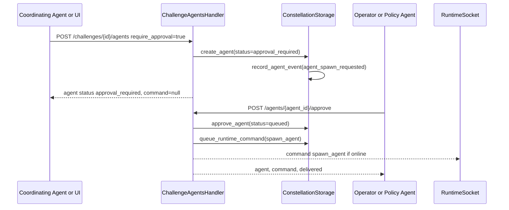
```mermaid
sequenceDiagram
    participant Agent as Coordinating Agent or UI
    participant API as ChallengeAgentsHandler
    participant Store as ConstellationStorage
    participant Approver as Operator or Policy Agent
    participant Runtime as RuntimeSocket

    Agent->>API: POST /challenges/{id}/agents require_approval=true
    API->>Store: create_agent(status=approval_required)
    Store->>Store: record_agent_event(agent_spawn_requested)
    API-->>Agent: agent status approval_required, command=null
    Approver->>API: POST /agents/{agent_id}/approve
    API->>Store: approve_agent(status=queued)
    API->>Store: queue_runtime_command(spawn_agent)
    API-->>Runtime: command spawn_agent if online
    API-->>Approver: agent, command, delivered
```

### Agent Rejection

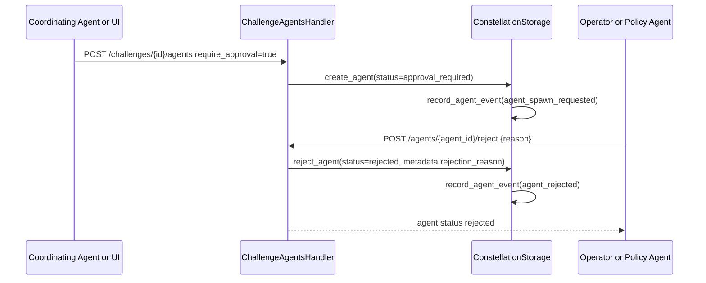
```mermaid
sequenceDiagram
    participant Agent as Coordinating Agent or UI
    participant API as ChallengeAgentsHandler
    participant Store as ConstellationStorage
    participant Approver as Operator or Policy Agent

    Agent->>API: POST /challenges/{id}/agents require_approval=true
    API->>Store: create_agent(status=approval_required)
    Store->>Store: record_agent_event(agent_spawn_requested)
    Approver->>API: POST /agents/{agent_id}/reject {reason}
    API->>Store: reject_agent(status=rejected, metadata.rejection_reason)
    Store->>Store: record_agent_event(agent_rejected)
    API-->>Approver: agent status rejected
```

### Agent-Facing MCP Orchestration

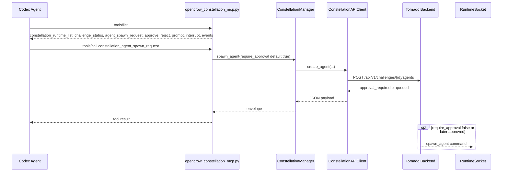
```mermaid
sequenceDiagram
    participant Codex as Codex Agent
    participant MCP as opencrow_constellation_mcp.py
    participant Manager as ConstellationManager
    participant Client as ConstellationAPIClient
    participant Backend as Tornado Backend
    participant Runtime as RuntimeSocket

    Codex->>MCP: tools/list
    MCP-->>Codex: constellation_runtime_list, challenge_status, agent_spawn_request, approve, reject, prompt, interrupt, events
    Codex->>MCP: tools/call constellation_agent_spawn_request
    MCP->>Manager: spawn_agent(require_approval default true)
    Manager->>Client: create_agent(...)
    Client->>Backend: POST /api/v1/challenges/{id}/agents
    Backend-->>Client: approval_required or queued
    Client-->>Manager: JSON payload
    Manager-->>MCP: envelope
    MCP-->>Codex: tool result
    opt require_approval false or later approved
        Backend-->>Runtime: spawn_agent command
    end
```

## Code-Level Implementation

### Module Responsibilities

| Module/file | Responsibility |
| --- | --- |
| `constellation/config.py` | Shared settings dataclasses and environment/config-file loading for clients, backend, UI, and runtime. |
| `constellation/backend.py` | Tornado REST API, runtime websocket, app state, route table, auth enforcement. |
| `constellation/storage.py` | MongoDB/GridFS repository, document shaping, indexes, challenge/agent/command/event/artifact state transitions. |
| `constellation/client.py` | HTTP and websocket URL helper used by CLI shims, UI, runtime, and MCP tools. |
| `constellation/runtime.py` | Host runtime service, websocket registration, command dispatch, workspace materialization, Codex SDK integration, writeup artifact upload. |
| `constellation/ui.py` | Flask dashboard routes that call the backend API and render runtime/challenge/agent/artifact views. |
| `scripts/opencrow_runtime_shim.py` | Compatibility adapter for legacy terminal entrypoints. |
| `scripts/opencrow-constellation-runtime` | Shell launcher for `python3 -m constellation.runtime` with repo `PYTHONPATH`. |
| `scripts/opencrow-autosetup` | Thin shell shim that delegates to `opencrow_runtime_shim.py autosetup`. |
| `scripts/opencrow-exploit` | Thin shell shim that delegates to `opencrow_runtime_shim.py exploit`. |
| `scripts/opencrow-constellation-join` | Thin shell shim that delegates to `opencrow_runtime_shim.py join`. |
| `scripts/opencrow_constellation_mcp.py` | MCP server including topic tools and new platform orchestration tools. |

### Class Diagram

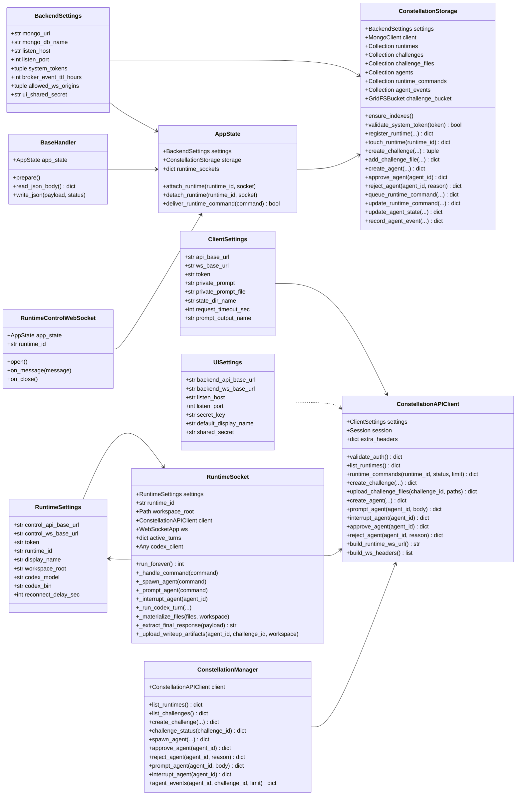
```mermaid
classDiagram
    direction LR

    class BackendSettings {
        +str mongo_uri
        +str mongo_db_name
        +str listen_host
        +int listen_port
        +tuple system_tokens
        +int broker_event_ttl_hours
        +tuple allowed_ws_origins
        +str ui_shared_secret
    }

    class ClientSettings {
        +str api_base_url
        +str ws_base_url
        +str token
        +str private_prompt
        +str private_prompt_file
        +str state_dir_name
        +int request_timeout_sec
        +str prompt_output_name
    }

    class UISettings {
        +str backend_api_base_url
        +str backend_ws_base_url
        +str listen_host
        +int listen_port
        +str secret_key
        +str default_display_name
        +str shared_secret
    }

    class RuntimeSettings {
        +str control_api_base_url
        +str control_ws_base_url
        +str token
        +str runtime_id
        +str display_name
        +str workspace_root
        +str codex_model
        +str codex_bin
        +int reconnect_delay_sec
    }

    class ConstellationAPIClient {
        +ClientSettings settings
        +Session session
        +dict extra_headers
        +validate_auth() dict
        +list_runtimes() dict
        +runtime_commands(runtime_id, status, limit) dict
        +create_challenge(...) dict
        +upload_challenge_files(challenge_id, paths) dict
        +create_agent(...) dict
        +prompt_agent(agent_id, body) dict
        +interrupt_agent(agent_id) dict
        +approve_agent(agent_id) dict
        +reject_agent(agent_id, reason) dict
        +build_runtime_ws_url() str
        +build_ws_headers() list
    }

    class ConstellationStorage {
        +BackendSettings settings
        +MongoClient client
        +Collection runtimes
        +Collection challenges
        +Collection challenge_files
        +Collection agents
        +Collection runtime_commands
        +Collection agent_events
        +GridFSBucket challenge_bucket
        +ensure_indexes()
        +validate_system_token(token) bool
        +register_runtime(...) dict
        +touch_runtime(runtime_id) dict
        +create_challenge(...) tuple
        +add_challenge_file(...) dict
        +create_agent(...) dict
        +approve_agent(agent_id) dict
        +reject_agent(agent_id, reason) dict
        +queue_runtime_command(...) dict
        +update_runtime_command(...) dict
        +update_agent_state(...) dict
        +record_agent_event(...) dict
    }

    class AppState {
        +BackendSettings settings
        +ConstellationStorage storage
        +dict runtime_sockets
        +attach_runtime(runtime_id, socket)
        +detach_runtime(runtime_id, socket)
        +deliver_runtime_command(command) bool
    }

    class BaseHandler {
        +AppState app_state
        +prepare()
        +read_json_body() dict
        +write_json(payload, status)
    }

    class RuntimeControlWebSocket {
        +AppState app_state
        +str runtime_id
        +open()
        +on_message(message)
        +on_close()
    }

    class RuntimeSocket {
        +RuntimeSettings settings
        +str runtime_id
        +Path workspace_root
        +ConstellationAPIClient client
        +WebSocketApp ws
        +dict active_turns
        +Any codex_client
        +run_forever() int
        +_handle_command(command)
        +_spawn_agent(command)
        +_prompt_agent(command)
        +_interrupt_agent(agent_id)
        +_run_codex_turn(...)
        +_materialize_files(files, workspace)
        +_extract_final_response(payload) str
        +_upload_writeup_artifacts(agent_id, challenge_id, workspace)
    }

    class ConstellationManager {
        +ConstellationAPIClient client
        +list_runtimes() dict
        +list_challenges() dict
        +create_challenge(...) dict
        +challenge_status(challenge_id) dict
        +spawn_agent(...) dict
        +approve_agent(agent_id) dict
        +reject_agent(agent_id, reason) dict
        +prompt_agent(agent_id, body) dict
        +interrupt_agent(agent_id) dict
        +agent_events(agent_id, challenge_id, limit) dict
    }

    BackendSettings --> ConstellationStorage
    BackendSettings --> AppState
    ClientSettings --> ConstellationAPIClient
    UISettings ..> ConstellationAPIClient
    RuntimeSettings --> RuntimeSocket
    RuntimeSocket --> ConstellationAPIClient
    RuntimeSocket --> RuntimeSettings
    AppState --> ConstellationStorage
    BaseHandler --> AppState
    RuntimeControlWebSocket --> AppState
    ConstellationManager --> ConstellationAPIClient
```

### Runtime Writeup Artifact Capture

After a Codex turn completes, `RuntimeSocket._upload_writeup_artifacts()` scans the agent workspace for root or nested files named:

- `writeup.md`
- `WRITEUP.md`
- `solution.md`
- `SOLUTION.md`

Matching files up to 2 MB are uploaded through `ConstellationAPIClient.upload_agent_artifacts()` with `artifact_type=writeup`. The backend stores each artifact in the `agent_artifacts` GridFS bucket, inserts metadata in the `agent_artifacts` collection, records one `agent_artifact` event per file, and the runtime emits a `writeup_artifacts_uploaded` event with the uploaded artifact list.

The challenge UI reads `/api/v1/agents/{id}/artifacts` for every displayed agent and renders artifact download links. Browser downloads are proxied through the Flask UI route `/agent-artifacts/{file_id}` so the operator does not need to put the backend bearer token in a URL.

### Backend Handler Families


```mermaid
classDiagram
    direction TB

    class BaseHandler {
        +prepare()
        +read_json_body()
        +write_json()
        +write_error()
    }

    class RuntimeCollectionHandler {
        +get()
    }

    class RuntimeCommandsHandler {
        +get(runtime_id)
    }

    class ChallengeCollectionHandler {
        +get()
        +post()
    }

    class ChallengeItemHandler {
        +get(challenge_id)
    }

    class ChallengeConvertHandler {
        +post(challenge_id)
    }

    class ChallengeFilesHandler {
        +get(challenge_id)
        +post(challenge_id)
    }

    class ChallengeAgentsHandler {
        +get(challenge_id)
        +post(challenge_id)
    }

    class AgentItemHandler {
        +get(agent_id)
    }

    class AgentApproveHandler {
        +post(agent_id)
    }

    class AgentRejectHandler {
        +post(agent_id)
    }

    class AgentEventsHandler {
        +get(agent_id)
    }

    class AgentPromptHandler {
        +post(agent_id)
    }

    class AgentInterruptHandler {
        +post(agent_id)
    }

    class ChallengeEventsHandler {
        +get(challenge_id)
    }

    BaseHandler <|-- RuntimeCollectionHandler
    BaseHandler <|-- RuntimeCommandsHandler
    BaseHandler <|-- ChallengeCollectionHandler
    BaseHandler <|-- ChallengeItemHandler
    BaseHandler <|-- ChallengeConvertHandler
    BaseHandler <|-- ChallengeFilesHandler
    BaseHandler <|-- ChallengeAgentsHandler
    BaseHandler <|-- AgentItemHandler
    BaseHandler <|-- AgentApproveHandler
    BaseHandler <|-- AgentRejectHandler
    BaseHandler <|-- AgentEventsHandler
    BaseHandler <|-- AgentPromptHandler
    BaseHandler <|-- AgentInterruptHandler
    BaseHandler <|-- ChallengeEventsHandler
```

## Data Contracts

### Runtime Document

```json
{
  "id": "local-smoke",
  "runtime_id": "local-smoke",
  "display_name": "Local Smoke Runtime",
  "status": "online",
  "capabilities": {
    "codex_sdk": true,
    "interactive_attach": true,
    "full_host_access": true
  },
  "workspace_root": "/tmp/opencrow-runtime-smoke",
  "metadata": {
    "pid": 1205718,
    "hostname": "host"
  },
  "created_at": "2026-05-13T06:50:31.105000+00:00",
  "last_seen_at": "2026-05-13T06:59:59.582000+00:00"
}
```

### Challenge Document

```json
{
  "id": "6a041f439da92d2120be7c2b",
  "slug": "tamuctf-neighbord",
  "title": "tamuctf_neighbord",
  "description": "Challenge text",
  "category": "reversing",
  "challenge_type": "single_agent",
  "status": "queued",
  "runtime_id": "local-smoke",
  "handoff_urls": [],
  "settings": {
    "model": "gpt-5.4-mini"
  },
  "metadata": {},
  "created_at": "2026-05-13T06:50:43.000000+00:00",
  "updated_at": "2026-05-13T06:50:43.000000+00:00"
}
```

### Agent Document

```json
{
  "id": "6a0420189da92d2120be7c3a",
  "challenge_id": "6a041f439da92d2120be7c2b",
  "runtime_id": "local-smoke",
  "role": "solo",
  "display_name": "smoke retry",
  "status": "completed",
  "codex_thread_id": "019e201d-6304-7ef2-8145-5c52816d29b3",
  "workspace_path": "/tmp/opencrow-runtime-smoke/tamuctf-neighbord/6a0420189da92d2120be7c3a",
  "model": "gpt-5.4-mini",
  "prompt": "Initial prompt text",
  "last_response": "runtime final response extraction works",
  "metadata": {},
  "created_at": "2026-05-13T06:54:16.675000+00:00",
  "updated_at": "2026-05-13T06:59:00.890000+00:00",
  "started_at": "2026-05-13T06:58:57.591000+00:00",
  "finished_at": "2026-05-13T06:59:00.890000+00:00"
}
```

### Runtime Command Document

```json
{
  "id": "6a0421319da92d2120be7d0a",
  "runtime_id": "local-smoke",
  "command_type": "prompt_agent",
  "challenge_id": "6a041f439da92d2120be7c2b",
  "agent_id": "6a0420189da92d2120be7c3a",
  "payload": {
    "body": "Post-fix smoke test."
  },
  "status": "completed",
  "created_at": "2026-05-13T06:58:57.579182+00:00",
  "updated_at": "2026-05-13T06:59:00.890000+00:00",
  "acknowledged_at": "2026-05-13T06:58:57.591000+00:00",
  "completed_at": "2026-05-13T06:59:00.890000+00:00",
  "error": null
}
```

### Agent Event Document

```json
{
  "id": "6a0421349da92d2120be7d18",
  "challenge_id": "6a041f439da92d2120be7c2b",
  "agent_id": "6a0420189da92d2120be7c3a",
  "runtime_id": "local-smoke",
  "event_type": "codex_notification",
  "payload": {
    "method": "item/completed",
    "payload": {
      "item": {
        "type": "agentMessage",
        "phase": "final_answer",
        "text": "runtime final response extraction works"
      }
    }
  },
  "created_at": "2026-05-13T06:59:00.866000+00:00"
}
```

## Configuration

### Backend

| Setting | Default | Purpose |
| --- | --- | --- |
| `OPENCROW_CONSTELLATION_MONGO_URI` | `mongodb://127.0.0.1:27017` | Mongo connection string. |
| `OPENCROW_CONSTELLATION_MONGO_DB` | `opencrow_constellation` | Database name. |
| `OPENCROW_CONSTELLATION_BACKEND_HOST` | `0.0.0.0` | Backend bind host. |
| `OPENCROW_CONSTELLATION_BACKEND_PORT` | `8787` | Backend bind port. |
| `OPENCROW_CONSTELLATION_SYSTEM_TOKEN` | `development-token-change-me` | Single bearer token fallback. |
| `OPENCROW_CONSTELLATION_SYSTEM_TOKENS` | unset | Comma-separated accepted bearer tokens. |
| `OPENCROW_CONSTELLATION_ALLOWED_WS_ORIGINS` | `http://127.0.0.1:8788,http://localhost:8788` | Allowed browser websocket origins for legacy topic websocket. |
| `OPENCROW_CONSTELLATION_UI_SHARED_SECRET` | unset | Optional UI-to-backend shared header secret. |

### UI

| Setting | Default | Purpose |
| --- | --- | --- |
| `OPENCROW_CONSTELLATION_UI_BACKEND_API_BASE_URL` | `http://127.0.0.1:8787` | Backend HTTP API base for Flask. |
| `OPENCROW_CONSTELLATION_UI_BACKEND_WS_BASE_URL` | derived from API base | Backend websocket base for Flask-rendered clients. |
| `OPENCROW_CONSTELLATION_UI_HOST` | `0.0.0.0` | UI bind host. |
| `OPENCROW_CONSTELLATION_UI_PORT` | `8788` | UI bind port. |
| `OPENCROW_CONSTELLATION_UI_SECRET_KEY` | development secret | Flask session secret. |
| `OPENCROW_CONSTELLATION_UI_DISPLAY_NAME` | `OpenCROW UI` | Default UI member display name. |
| `OPENCROW_CONSTELLATION_UI_SHARED_SECRET` | development UI secret | Optional shared secret sent as `X-Constellation-UI-Auth`. |

### Runtime

| Setting | Default | Purpose |
| --- | --- | --- |
| `OPENCROW_RUNTIME_CONTROL_API_BASE_URL` | `http://127.0.0.1:8787` | Backend REST API base used by the runtime. |
| `OPENCROW_RUNTIME_CONTROL_WS_BASE_URL` | derived from API base | Backend websocket base used by the runtime. |
| `OPENCROW_RUNTIME_TOKEN` | `development-token-change-me` | Runtime bearer token. |
| `OPENCROW_RUNTIME_ID` | generated from hostname and PID | Stable runtime id override. |
| `OPENCROW_RUNTIME_DISPLAY_NAME` | generated from hostname | Dashboard display name. |
| `OPENCROW_RUNTIME_WORKSPACE_ROOT` | `~/.local/share/opencrow/runtime-workspaces` | Root for per-agent host workspaces. |
| `OPENCROW_RUNTIME_CODEX_MODEL` | unset | Default Codex model passed to SDK turns. |
| `OPENCROW_RUNTIME_CODEX_BIN` | unset | Optional Codex CLI binary override through SDK `AppServerConfig`. |
| `OPENCROW_RUNTIME_RECONNECT_DELAY_SEC` | `5` | Delay between websocket reconnect attempts. |

### Client And MCP

| Setting | Default | Purpose |
| --- | --- | --- |
| `OPENCROW_CONSTELLATION_API_BASE_URL` | `http://127.0.0.1:8787` | REST API base for CLI/MCP clients. |
| `OPENCROW_CONSTELLATION_WS_BASE_URL` | derived from API base | Websocket base for CLI/MCP clients. |
| `OPENCROW_CONSTELLATION_TOKEN` | `development-token-change-me` | Bearer token for CLI/MCP clients. |
| `OPENCROW_CONSTELLATION_REQUEST_TIMEOUT_SEC` | `20` | HTTP request timeout for clients. |

## Agent-Orchestration MCP Tools

The Constellation MCP server exposes platform tools so Codex agents can manage work without shelling out to bespoke scripts.

| Tool | Purpose |
| --- | --- |
| `constellation_runtime_list` | List runtime fleet state and capabilities. |
| `constellation_runtime_commands` | Inspect queued/running/completed commands for a runtime. |
| `constellation_challenge_list` | List dashboard-managed challenges. |
| `constellation_challenge_create` | Create a challenge through the platform API. |
| `constellation_challenge_status` | Read challenge, files, agents, and recent events. |
| `constellation_challenge_convert` | Promote a single-agent challenge to Constellation mode. |
| `constellation_agent_list` | List agents for a challenge. |
| `constellation_agent_spawn_request` | Request or directly queue an agent. Defaults to `require_approval=true`. |
| `constellation_agent_approve` | Approve a pending agent and queue runtime execution. |
| `constellation_agent_reject` | Reject a pending agent and record the reason. |
| `constellation_agent_prompt` | Queue a follow-up prompt for an existing agent. |
| `constellation_agent_interrupt` | Queue an interrupt for a running agent. |
| `constellation_agent_events` | Read agent or challenge event history. |

The default approval behavior is intentional. A coordinating agent can ask for more workers, but the platform can keep a human or policy agent in the approval path before the runtime spends host resources.

## Error Handling And Recovery

### Runtime Disconnects

If the runtime disconnects, `RuntimeControlWebSocket.on_close()` detaches the socket and marks the runtime offline. Commands already persisted in `runtime_commands` remain `queued` unless the runtime had already reported `running`, `completed`, or `failed`. When the runtime reconnects and registers with the same `runtime_id`, the backend sends every queued command for that runtime.

### Command Delivery

`AppState.deliver_runtime_command()` is opportunistic. It writes the command to the currently attached runtime socket if one exists and returns `true`; otherwise it returns `false`. The command document is still durable, so `delivered=false` is not a hard failure. It means execution waits for runtime registration or reconnect.

### Codex SDK Availability

The runtime checks SDK availability for capability reporting, but imports the SDK only inside execution paths. Missing SDK installation fails the current command and agent with a clear error:

```text
The Python Codex SDK package `openai-codex` is not installed.
```

### Thread Resume Failures

For follow-up prompts, the runtime attempts `thread_resume(codex_thread_id, cwd, model)`. If the SDK reports that the thread cannot be resumed, the runtime starts a new thread and updates the agent with the replacement `codex_thread_id`. This keeps the dashboard command usable even after a runtime process restart or SDK-side thread cache loss.

### Final Response Extraction

Codex SDK stream payloads vary by notification type. `RuntimeSocket._notification_payload()` normalizes enum, pydantic, object, list, tuple, and primitive payloads into JSON-compatible values. `RuntimeSocket._extract_final_response()` then looks for final text in these locations:

- `payload.final_response`
- `payload.payload.item.root.text`
- `payload.payload.item.text`
- `payload.item.text`
- `payload.item.message`

The last non-empty extracted value is persisted to `agents.last_response` when the turn completes.

## Security Model

The current implementation uses shared bearer tokens. That is intentionally simple for local and private deployments, but the architecture leaves room to replace token validation with stronger identity later.

Current controls:

- Every REST endpoint except `/api/v1/health` requires a system token.
- `/runtime/ws` validates the same system token before accepting runtime registration.
- The UI stores the user-supplied backend token in the Flask session.
- The optional UI shared secret can distinguish trusted UI calls when the backend needs to normalize `client_kind=ui`.
- Runtime host access is intentionally broad. The runtime advertises `full_host_access: true` because Codex is expected to use local challenge tooling.

Operational implications:

- Do not expose the backend to untrusted networks with the default development token.
- Treat runtime hosts as privileged execution environments.
- Use a stable `OPENCROW_RUNTIME_ID` for remote runtimes so queued commands survive reconnects.
- Isolate workspaces per challenge/agent through `OPENCROW_RUNTIME_WORKSPACE_ROOT`.

## Extensibility Points

### Adding A New Runtime Command

1. Add a new command producer in the backend or client that calls `ConstellationStorage.queue_runtime_command()`.
2. Add a handler branch in `RuntimeSocket._handle_command()`.
3. Implement the host-side method in `constellation/runtime.py`.
4. Emit `agent_state`, `agent_event`, and `command_status` messages so the dashboard remains observable.
5. Add any needed MCP method in `scripts/opencrow_constellation_mcp.py`.
6. Document the command in the runtime websocket protocol table.

### Adding A New Agent Status

1. Ensure `ConstellationStorage.update_agent_state()` sets timestamps correctly for the new state.
2. Update dashboard rendering if the state requires actions or visual treatment.
3. Update the agent state diagram in this document.
4. Add smoke coverage through HTTP or MCP where possible.

### Adding A New Runtime Capability

1. Add it to the `capabilities` payload in `RuntimeSocket._on_open()`.
2. Store it unchanged through `ConstellationStorage.register_runtime()`.
3. Read it from `/api/v1/runtimes` in the dashboard or MCP clients.
4. Avoid making command dispatch depend on a capability unless the API returns a clear error path.

## Operational Runbooks

### Local Development

```bash
docker compose -f docker-compose.constellation.yml up --build
opencrow-constellation-runtime
```

Open the UI on the configured UI port, authenticate with the configured system token, create a challenge, upload files, and spawn an agent.

### Host-Side Smoke Test

```bash
OPENCROW_CONSTELLATION_API_BASE_URL=http://127.0.0.1:8787 \
OPENCROW_CONSTELLATION_WS_BASE_URL=ws://127.0.0.1:8787 \
opencrow-autosetup --output-dir /path/to/challenge --category reversing --model gpt-5.4-mini
```

Expected result:

1. A challenge is created in the dashboard.
2. The workspace archive is uploaded.
3. A `solo` agent is created.
4. A `spawn_agent` command is queued and delivered if a runtime is online.
5. The runtime extracts files into `workspace_root/challenge_slug/agent_id`.
6. Codex stream events appear in the challenge event feed.
7. The agent reaches `completed` or `failed` with a persisted `last_response` or error metadata.

### Inspect Runtime Queue

```bash
curl -H "Authorization: Bearer $OPENCROW_CONSTELLATION_TOKEN" \
  "$OPENCROW_CONSTELLATION_API_BASE_URL/api/v1/runtimes/$OPENCROW_RUNTIME_ID/commands"
```

Use this when a command was created with `delivered=false` or a runtime was offline.

### Agent-Orchestration Smoke Test

1. Call `constellation_runtime_list` through MCP to confirm the backend is reachable.
2. Call `constellation_challenge_status` for a known challenge.
3. Call `constellation_agent_spawn_request` with `require_approval=true`.
4. Confirm the agent status is `approval_required`.
5. Call `constellation_agent_reject` or `constellation_agent_approve`.
6. Confirm an `agent_rejected`, `agent_state`, or runtime command event appears in `constellation_agent_events`.

## Known Limitations

- The runtime command protocol is JSON over websocket and currently versioned only by subprotocol name.
- Runtime command execution happens in daemon threads inside one runtime process; there is no runtime-level process supervisor yet.
- `interrupt_agent` can only interrupt turns tracked in the current runtime process memory.
- Approval policy is implemented as API state, not as a pluggable policy engine.
- The UI currently refreshes by page navigation rather than a browser-side live event stream for challenge events.
- The same backend token model is used for operators, runtimes, CLI clients, and MCP tools.

## Verification Performed During The Rework

The runtime-dashboard branch was validated with:

```bash
python3 -m py_compile \
  constellation/config.py \
  constellation/storage.py \
  constellation/backend.py \
  constellation/client.py \
  constellation/runtime.py \
  constellation/ui.py \
  scripts/opencrow_runtime_shim.py \
  scripts/opencrow_constellation_mcp.py \
  scripts/install_cli.py

python3 -m json.tool scripts/tool_catalog.json >/dev/null
scripts/opencrow-autosetup --dry-run --no-upload --category web
scripts/opencrow-exploit --dry-run --no-upload
scripts/opencrow-constellation-join missing-topic --dry-run --no-upload
python3 scripts/check_mcp_server.py /home/zerotwo/open-crow/scripts/opencrow-constellation-mcp
```

A live smoke test also used a local challenge from `/home/zerotwo/ctf_test_env/rev/tamuctf_neighbord`, a host runtime, the backend, the UI, MongoDB, and the installed Codex SDK. The final follow-up prompt confirmed normalized Codex stream payloads and persisted `agents.last_response`.
