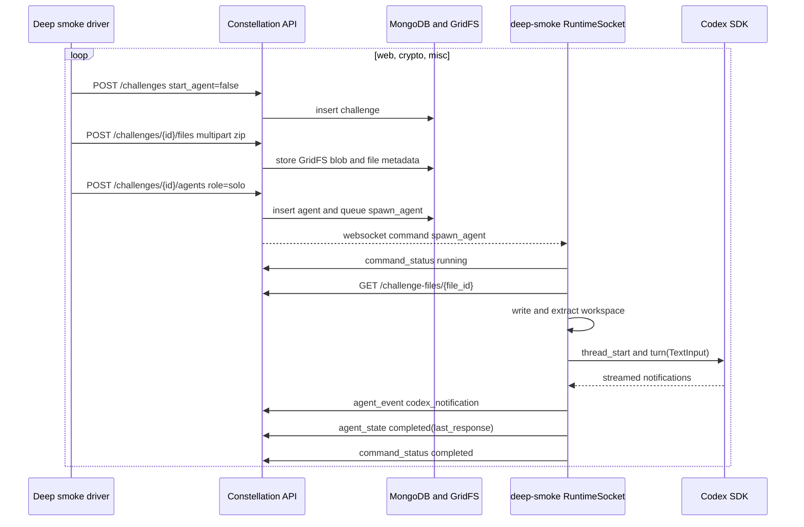

# Runtime Deep Smoke Test

This note records the deeper runtime-dashboard smoke test performed on May 14, 2026. The goal was to exercise the new platform with three different challenge categories, each with uploaded local files and a real Codex SDK agent turn:

- `web`
- `crypto`
- `misc`

The test was intentionally bounded. Each agent was asked to inspect the workspace, identify the task shape, and return a concise three-bullet triage. The agents were not asked to fully solve the challenges or use the network.

## Test Setup

The test used the existing feature branch and the local Constellation stack:

```bash
docker compose -f docker-compose.constellation.yml up -d mongo mongo-init-replica
```

The backend was started on the host with direct Mongo access:

```bash
OPENCROW_CONSTELLATION_MONGO_URI='mongodb://127.0.0.1:27017/?directConnection=true' \
OPENCROW_CONSTELLATION_BACKEND_HOST=127.0.0.1 \
OPENCROW_CONSTELLATION_BACKEND_PORT=8787 \
python3 -m constellation.backend
```

The UI was started on `127.0.0.1:8788`:

```bash
OPENCROW_CONSTELLATION_UI_BACKEND_API_BASE_URL=http://127.0.0.1:8787 \
OPENCROW_CONSTELLATION_UI_BACKEND_WS_BASE_URL=ws://127.0.0.1:8787 \
OPENCROW_CONSTELLATION_UI_HOST=127.0.0.1 \
OPENCROW_CONSTELLATION_UI_PORT=8788 \
python3 -m constellation.ui
```

The host runtime was started outside the container boundary:

```bash
OPENCROW_RUNTIME_CONTROL_API_BASE_URL=http://127.0.0.1:8787 \
OPENCROW_RUNTIME_CONTROL_WS_BASE_URL=ws://127.0.0.1:8787 \
OPENCROW_RUNTIME_ID=deep-smoke \
OPENCROW_RUNTIME_DISPLAY_NAME='Deep Smoke Runtime' \
OPENCROW_RUNTIME_WORKSPACE_ROOT=/tmp/opencrow-runtime-deep-smoke \
OPENCROW_RUNTIME_CODEX_MODEL=gpt-5.4-mini \
python3 -m constellation.runtime
```

The runtime registered successfully:

```json
{
  "runtime_id": "deep-smoke",
  "display_name": "Deep Smoke Runtime",
  "status": "online",
  "capabilities": {
    "codex_sdk": true,
    "interactive_attach": true,
    "full_host_access": true
  },
  "workspace_root": "/tmp/opencrow-runtime-deep-smoke"
}
```

## Fixture Discovery

Challenge fixtures were searched under `/home/zerotwo` using directory and file names associated with CTF categories:

```bash
find /home/zerotwo -maxdepth 5 -type d \
  \( -iname '*web*' -o -iname '*crypto*' -o -iname '*misc*' -o -iname '*rev*' -o -iname '*pwn*' \)
```

Compact fixtures were selected to keep file upload and Codex inspection time low:

| Category | Source path | Size | Reason selected |
| --- | --- | ---: | --- |
| `web` | `/home/zerotwo/umdctf/web/open-insight` | 104K | Contains notes and Playwright evidence without a large dependency tree. |
| `crypto` | `/home/zerotwo/umdctf/crypto/no-brainrot` | 80K | Contains challenge scripts, solver notes, and crypto-specific files. |
| `misc` | `/home/zerotwo/umdctf/misc/quant` | 20K | Small miscellaneous quantum/OpenQASM challenge fixture. |

## Challenge Creation

The three challenges were created through `ConstellationAPIClient`, using the same upload path as the legacy shim:

1. Create challenge with `start_agent=false`.
2. Zip and upload the fixture directory.
3. Create a `solo` agent with a bounded inspection prompt.
4. Let the backend queue `spawn_agent`.
5. Let the connected `deep-smoke` runtime execute each command.



## Created Tasks

| Category | Challenge slug | Challenge id | Agent id | Uploaded archive size |
| --- | --- | --- | --- | ---: |
| `web` | `deep-smoke-web-open-insight` | `6a064cb776a0b519d737c5e3` | `6a064cb776a0b519d737c5e7` | 13,118 bytes |
| `crypto` | `deep-smoke-crypto-no-brainrot` | `6a064cb776a0b519d737c5ea` | `6a064cb776a0b519d737c5f0` | 11,308 bytes |
| `misc` | `deep-smoke-misc-quant` | `6a064cb776a0b519d737c5f3` | `6a064cb776a0b519d737c5f9` | 2,988 bytes |

## Agent Results

All three `spawn_agent` runtime commands completed successfully.

| Category | Agent status | Codex thread id | Workspace materialized | Result |
| --- | --- | --- | --- | --- |
| `web` | `completed` | `019e289b-b3f9-7190-a913-ba5dfa323536` | `/tmp/opencrow-runtime-deep-smoke/deep-smoke-web-open-insight/6a064cb776a0b519d737c5e7` | Non-empty `last_response` with web attack-surface triage. |
| `crypto` | `completed` | `019e289b-b419-7dd3-990a-334e40624a03` | `/tmp/opencrow-runtime-deep-smoke/deep-smoke-crypto-no-brainrot/6a064cb776a0b519d737c5f0` | Non-empty `last_response` identifying textbook RSA/oracle behavior. |
| `misc` | `completed` | `019e289b-b369-73d1-9e65-c65fb915e80a` | `/tmp/opencrow-runtime-deep-smoke/deep-smoke-misc-quant/6a064cb776a0b519d737c5f9` | Non-empty `last_response` identifying a quantum/OpenQASM domain. |

### Web Response

```text
- Files observed: `opencrow-open-insight-2v_3fcfu.zip`, `findings.md`, `changelog.md`, and `.playwright-cli/*` browser logs/screenshots.
- Likely web attack surface: a Next.js spreadsheet app with formula cells at `/sheets/<id>`, server-action auth (`/signup`, `/login`), and a bot that POSTs `sheetId` to `/report` and opens the sheet in an authenticated browser.
- Next test to run: create a fresh sheet with a harmless formula probe like `=document.title` or `=Number.constructor("return 1")()` and confirm whether the formula executes in the bot-accessible page.
```

### Crypto Response

```text
- Files observed: `server.py`, `solve.py`, `encode.py`, `test_intervals.py`, and notes in `findings.md`, `handoff.md`, `changelog.md`, plus the challenge zip.
- Likely primitive/weakness: raw textbook RSA with public `n,e`, chosen-ciphertext oracle, and a leak on `hex(pow(user_ct, d, n)).startswith("0x67")`; multiplicative homomorphism plus variable-length hex prefix gives an interval-based oracle.
- Next test to run: locally dry-run `solve.py` or `test_intervals.py` to confirm the interval model shrinks on boundary multipliers and keep tracking the 111-byte candidate length.
```

### Misc Response

```text
- Files observed: `solve.py`, `findings.md`, `changelog.md`, `writeup.md`, `opencrow-quant-jbv7npbp.zip`
- Likely problem domain: quantum / OpenQASM black-box oracle search, specifically Grover-style amplitude amplification over 16 qubits
- Next test to run: inspect the zip contents and dry-run `solve.py` offline to confirm the generated QASM structure and payload size
```

## Command Evidence

The runtime command queue for `deep-smoke` showed three completed `spawn_agent` commands:

| Category | Command id | Status | Created at | Completed at | Error |
| --- | --- | --- | --- | --- | --- |
| `web` | `6a064cb776a0b519d737c5e9` | `completed` | `2026-05-14T22:29:11.621000+00:00` | `2026-05-14T22:29:36.173000+00:00` | `null` |
| `crypto` | `6a064cb776a0b519d737c5f2` | `completed` | `2026-05-14T22:29:11.681000+00:00` | `2026-05-14T22:29:35.409000+00:00` | `null` |
| `misc` | `6a064cb776a0b519d737c5fb` | `completed` | `2026-05-14T22:29:11.744000+00:00` | `2026-05-14T22:29:26.884000+00:00` | `null` |

The event feeds contained `codex_notification` and `agent_state` events for each agent. The `misc` task also included the initial `agent_created` event in the limited event window queried during validation.

## Workspace Materialization Evidence

The runtime extracted the uploaded archives into per-agent workspaces:

```text
/tmp/opencrow-runtime-deep-smoke/deep-smoke-web-open-insight/6a064cb776a0b519d737c5e7/changelog.md
/tmp/opencrow-runtime-deep-smoke/deep-smoke-web-open-insight/6a064cb776a0b519d737c5e7/findings.md
/tmp/opencrow-runtime-deep-smoke/deep-smoke-web-open-insight/6a064cb776a0b519d737c5e7/opencrow-open-insight-2v_3fcfu.zip
/tmp/opencrow-runtime-deep-smoke/deep-smoke-crypto-no-brainrot/6a064cb776a0b519d737c5f0/server.py
/tmp/opencrow-runtime-deep-smoke/deep-smoke-crypto-no-brainrot/6a064cb776a0b519d737c5f0/solve.py
/tmp/opencrow-runtime-deep-smoke/deep-smoke-crypto-no-brainrot/6a064cb776a0b519d737c5f0/test_intervals.py
/tmp/opencrow-runtime-deep-smoke/deep-smoke-misc-quant/6a064cb776a0b519d737c5f9/solve.py
/tmp/opencrow-runtime-deep-smoke/deep-smoke-misc-quant/6a064cb776a0b519d737c5f9/writeup.md
```

## Coverage

This test covered:

- Runtime registration with `codex_sdk: true`.
- Runtime websocket command delivery for three queued agents.
- Challenge creation with `start_agent=false`.
- GridFS challenge file upload.
- Runtime file download and archive extraction.
- Three concurrent/overlapping Codex SDK turns on one runtime process.
- Codex thread id persistence.
- Codex stream event normalization.
- Final response extraction into `agents.last_response`.
- Runtime command completion timestamps and null error fields.
- Category diversity across web, crypto, and misc tasks.

This test did not cover:

- Full challenge solving.
- Networked challenge services.
- Operator approval flow, because that was covered separately by the approval-gated API smoke test.
- Runtime restart during the three task run.
